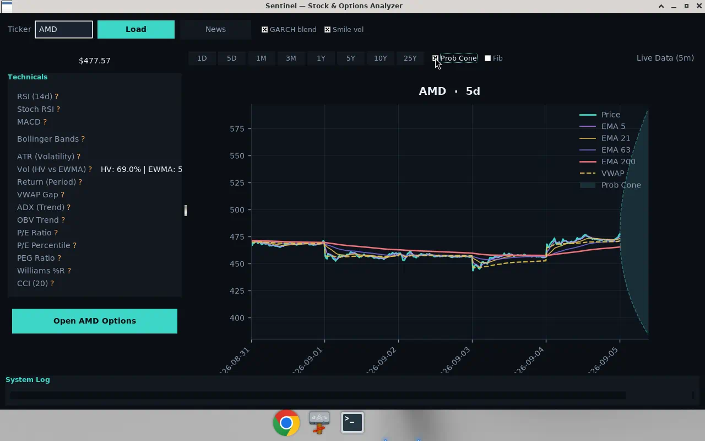
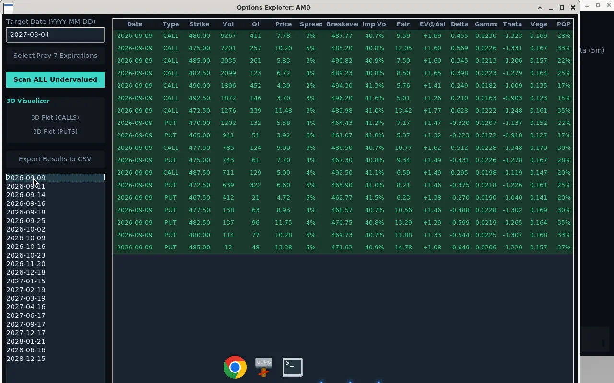

# Sentinel Chimp 🛡️

**Sentinel Chimp** is a sophisticated, Python-based market analysis dashboard designed for retail traders who demand institutional-grade mathematics. It bridges the gap between basic charting tools and professional quantitative platforms, featuring advanced options pricing models, volatility forecasting, and real-time technical analysis.

> **⚠️ Release Note:** The standalone release package operates in **"Lite Mode"** for maximum compatibility. It **does not include** the AI Sentiment Analysis engine to keep file sizes manageable and ensure it runs smoothly on standard systems. To use AI features, run the application from source.

---

## Screenshots






## 🚀 Key Features

### 1. Advanced Options Valuation
Unlike standard calculators that use Black-Scholes, Sentinel uses the **Bjerksund-Stensland (2002)** model to price American options.
* **Log-Space Algebra:** Prevents mathematical overflow/underflow during extreme volatility events.
* **Dynamic Risk-Free Rate:** Automatically uses term-aware treasury inputs with interpolation between short-end (^IRX) and long-end (^TNX) rates.
* **Edge Detection:** Scans option chains to find contracts where the Market Price diverges significantly from the Theoretical Value (EV).
* **3D Landscape Visualization:** Interactive 3D plotting of "Strike vs. Expiry vs. Expected Value," allowing you to visually spot "islands of value" across the entire option chain.

### 2. Institutional Volatility Forecasting
Sentinel looks beyond simple Historical Volatility (HV).
* **EWMA Forecasting:** RiskMetrics-style λ=0.94 EWMA (always).
* **Optional GARCH / smile:** GUI toggles for fitted GARCH(1,1) blend and quadratic IV smile smoothing.
* **Options fair value:** Forecast vol only (EWMA ± GARCH); market IV is shown and used for Greeks — see Options Finder rules in `docs/LOGIC_REVIEW.md`.

### 3. Smart Technical Dashboard
A threaded, non-blocking GUI featuring a professional Dark Mode interface optimized for low eye strain:
* **Momentum:** RSI (14), Stoch RSI, MACD.
* **Trend Strength:** ADX (Average Directional Index) to distinguish between trending and chopping markets.
* **Volume Analysis:** OBV (On-Balance Volume) trend detection and **VWAP Gap** analysis (Intraday Bull/Bear control).
* **Risk:** ATR (Average True Range) for volatility-based stop losses.
* **Fundamental Context:** Displays P/E Ratios (TTM/Fwd) and calculates a **P/E Percentile** to show if the stock is historically cheap or expensive.

### 4. AI Sentiment Engine (Source Code Only)
* **Model:** Powered by `ProsusAI/finbert` (Financial BERT).
* **Function:** Scrapes news headlines (Yahoo/Google RSS) and computes a sentiment score (-1 to +1) using a Transformer model specifically fine-tuned for financial text.
* *Note: Requires PyTorch and Transformers libraries.*

---

## 📦 Compatibility & Release Info

The app can be used as a prebuilt executable on **Windows** and as a packaged app on **macOS**.

To ensure this tool works on standard trading laptops without requiring NVIDIA GPUs or massive libraries, the **pre-compiled Release Package** differs from the source code:

| Feature | Source Code (`.py`) | Release Package (`.exe` / `.app`) |
| :--- | :---: | :---: |
| **Charting & Technicals** | ✅ Included | ✅ Included |
| **Bjerksund-Stensland Math** | ✅ Included | ✅ Included |
| **EWMA/HV Volatility Logic** | ✅ Included | ✅ Included |
| **Options Scanner** | ✅ Included | ✅ Included |
| **3D Visualizer** | ✅ Included | ✅ Included |
| **AI Sentiment (FinBERT)** | ✅ **Active** | ❌ **Disabled** |

**Why is AI disabled in the release?**
The AI engine relies on `PyTorch` and `Transformers`, which can add over 1GB to the file size and may cause compatibility issues on computers without specific drivers. The Release Package is optimized for speed and portability.

---

## 🛠️ Installation

### Option A: Running from Source (Full Features)
To use the AI Sentiment engine, you must run from the source:

1.  **Clone the Repo**
    ```bash
    git clone [https://github.com/omaralaaeldein/Sentinel-Chimp.git](https://github.com/omaralaaeldein/Sentinel-Chimp.git)
    cd Sentinel-Chimp
    ```
2.  **Install Dependencies**
    ```bash
    pip install -r requirements.txt
    ```
    *(Ensure `torch`, `transformers`, `yfinance`, `pandas`, `numpy`, `matplotlib`, `plotly` are installed)*
3.  **Run**
    ```bash
    python sentinel.py
    ```

### Option B: Using the Release Package (Windows)
1.  Download the latest `.zip` from the **Releases** tab.
2.  Extract the folder.
3.  Run `Sentinel.exe`.
4.  *No Python installation required.*

### Option C: Using the macOS Executable/App Bundle
1.  Build the macOS app bundle:
    ```bash
    ./build_macos.sh --auto --onedir --install-deps
    ```
2.  Launch the generated app:
    ```bash
    open "dist/Sentinel.app"
    ```
3.  You can also run `./build_macos.command` to launch the build script interactively.


---

## 🧱 Project Structure (Phase I MVC)

`python sentinel.py` remains the supported entrypoint (`Stocks.cmd` / build scripts unchanged).

| Path | Role |
| :--- | :--- |
| `sentinel.py` | Thin launcher + backwards-compatible re-exports |
| `core/pricing.py` | `VegaChimpCore` (BS / BS2002 batch / EWMA / American FD Greeks) |
| `core/technicals.py` | `calculate_technicals` |
| `core/sentiment.py` | FinBERT `SentimentEngine` |
| `core/data.py` | `DataProvider` ABC + `YFinanceProvider` |
| `core/vol_models.py` | Probability cone, GARCH(1,1), quadratic smile |
| `core/options_scan.py` | Tradeable-edge / liquidity filters for Options Finder |
| `ui/` | Theme, chart, news, options explorer, tooltip, prefs |
| `main/app.py` | `MarketApp` controller |
| `docs/LOGIC_REVIEW.md` | Paper mapping, scan rules, perf notes |
| `to_do.md` | Roadmap with live statuses |

---

## 📉 Usage Guide

1.  **Ticker Entry:** Type a ticker (e.g., `NVDA`, `SPY`) and press Enter / **Load**.
2.  **Technicals:** Review the left panel for RSI, MACD, VWAP Gap, and Volatility stats.
3.  **Chart toggles:** **Prob Cone** (on by default), **Fib** (off by default), period buttons (1D…25Y). Optional **GARCH blend** / **Smile vol** near the ticker bar.
4.  **Options Scanner:**
    * Click **"Open … Options"**.
    * Select expiration(s), or **Scan ALL Undervalued**.
    * Fair value uses **forecast vol** (EWMA ± GARCH), not the contract’s own IV.
    * **EV@Ask** is tradeable edge vs the ask (must clear half-spread + liquidity/ATM filters).
    * **Green** = Under (candidate long); **Red** = Over (candidate write). See `docs/LOGIC_REVIEW.md`.
    * **3D Plot** visualizes the filtered surface.
5.  **Export:** CSV scan results or HTML 3D plots.

---

## 💡 Inspiration & Credits
This project was built with inspiration from the open-source community. Special thanks to the following projects for their foundational concepts and approaches:

* [**Vegachimp**](https://github.com/Orange-The-Fruit/vegachimp/tree/main) by *Orange-The-Fruit*
* [**PyStock**](https://github.com/ikitcheng/pystock) by *ikitcheng*

---

## ⚖️ Disclaimer
*This software is for educational and research purposes only. It is not financial advice. The Bjerksund-Stensland model and volatility estimates (EWMA/HV/IV-based) are theoretical approximations and do not guarantee future market behavior. Always trade at your own risk.*
